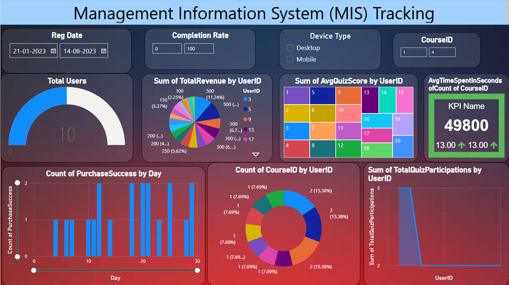

📊 DataAnalyst_User_Behavior_Tracking_System

A real-time Management Information System (MIS) dashboard developed using SQL and Power BI to monitor user behavior, business performance, and operational efficiency. This project empowers stakeholders with insightful, visually rich analytics to support data-driven decisions across teams.

🎯 Project Goal

The goal of this project is to build a comprehensive MIS solution that provides a high-level overview of business operations with a specific focus on user behavior and engagement. The dashboard captures and displays key performance indicators (KPIs) like revenue trends, user participation, course performance, and device usage. It serves as a single source of truth for decision-makers to monitor progress, identify patterns, and make informed strategic decisions.

🔧 Process Overview

The project began with extracting raw data from multiple sources using SQL. The data was cleaned and transformed to ensure accuracy and consistency. In Power BI, a well-structured data model was created with appropriate relationships and calculated measures using DAX. The dashboard design focused on simplicity, clarity, and interactivity—incorporating slicers, filters, and conditional formatting to allow dynamic exploration of data. Automation was enabled via scheduled refreshes to keep reports up to date without manual intervention.

✨ Key Features

- 📈 Real-time display of user engagement, course performance, and revenue metrics  
- 📅 Date-based filtering to track trends over time  
- 🧑‍💻 Device segmentation to monitor Desktop vs Mobile usage  
- 📊 Interactive visuals including pie charts, bar graphs, tree maps, and KPI cards  
- 🎯 Drill-down capabilities to explore user-level and course-level performance  
- 🔄 Automated data refresh using Power BI Service  
- 🎨 Clean and intuitive layout with conditional formatting for enhanced readability

📎 Use Case

This dashboard is designed for data analysts, platform managers, and business stakeholders who aim to:

- Monitor user behavior and platform engagement
- Track course participation and performance metrics
- Analyze data segmented by device type and registration periods
- Optimize operational decisions based on real-time insights
- Eliminate manual reporting through automation and visualization

📷 Dashboard Preview

🛠 Tools & Technologies

- **SQL** – for data extraction, cleaning, and preparation  
- **Power BI** – for data modeling, visualization, and reporting  
- **DAX** – for creating custom measures and KPIs  
- **Power BI Service** – for scheduled refresh and report sharing

👤 Author

Arge Ganga Prasad
Aspiring Data Analyst | SQL & Power BI Dashboard Enthusiast  

📫 [LinkedIn](https://www.linkedin.com/in/arge-gangaprasad/)  | 💻 [GitHub](https://github.com/gangaprasadarge)

